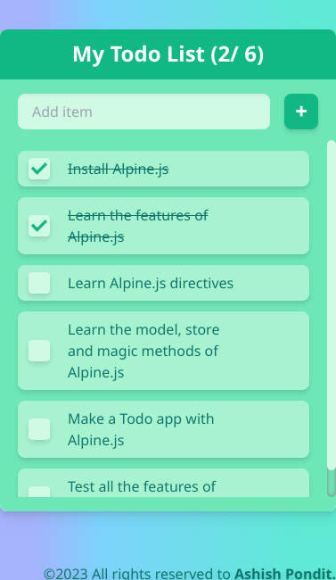
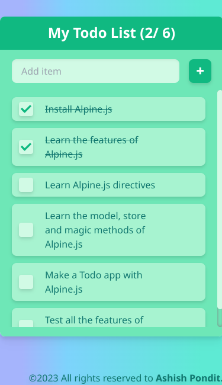
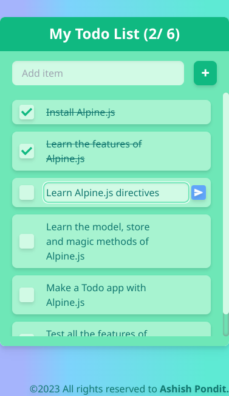
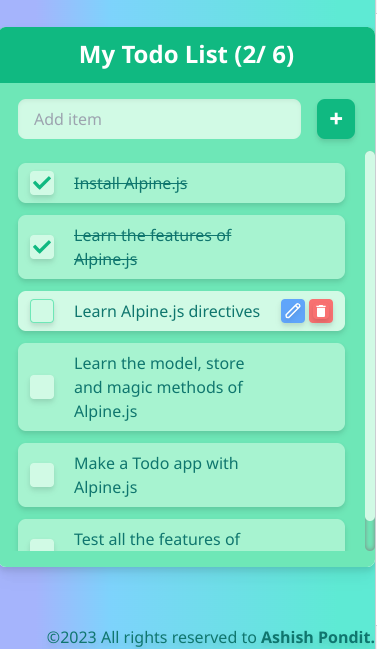
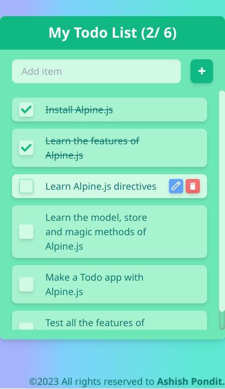
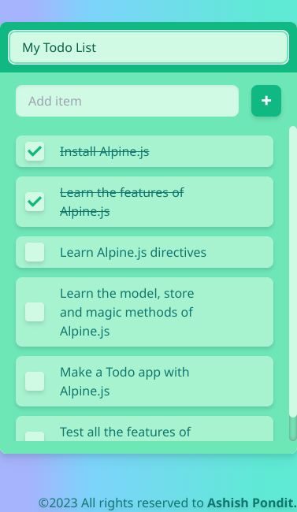
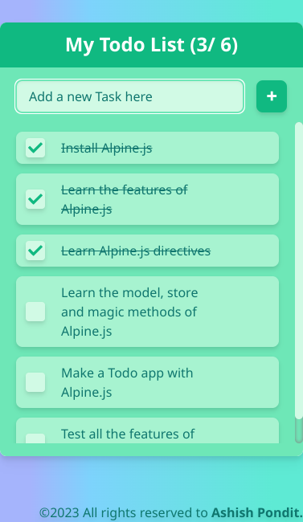

# Todo App with Alpine.js

## A simple **Todo app** to manage tasks. You can do the following:

-   Create new task
-   Edit exitign tasks
-   View list of tasks
-   Mark tasks as completed
-   Delete a tasks
-   Modify title of the todo app

## Some snapshots of the App

<table>
    <tr>
        <td></td>
        <td></td>
        <td></td>
        <td></td>
    </tr>
    <tr>
        <td></td>
        <td></td>
        <td></td>
    </tr>
</table>
